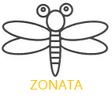

##### 背景
  容器技术以cgroup进行资源管理，从linux-4.5版本之后同时支持cgroup v1和v2两个版本，通常可以使用k8s插件对容器常规资源(如cpu/mem/io/pids等)进行管理，同时有的工具直接采集/sys/fs/cgroup下的内容进行展示和判断，这些方式有以下局限性：
1. 从sysfs采集数据，每读取一个控制文件会触发一次syscall及内核态到用户态的数据拷贝，当cgroup数量多时带来的系统资源消耗较大；
2. 用户（管理员）通常只关注group的资源到达设定阈值或即将到达时，周期性的数据采集用处较小；
3. group内进程运行状态不易评估，cgroup大量的参数，不同的配置产生不同效果。

##### zonata
  zonata，为了更好管理的管理cgroup资源而生，基于ebpf、psi、perf等技术，针对某一特定资源，实现事件式的监控，在资源到达预设点时触发通知，也可只关注cgroup内进程负载，到达指定阈值时通知。同时也可采集cgroup内的PMU事件信息，对cgroup内进程的运行状况进行评估，协助管理员对cgroup资源进行更加合适的配置。

##### 功能简介

1.
   支持top方式对整个主机的cgroup资源进行排序展示；
   支持以node exporter格式对cgroup资源进行输出；
   支持对memory，swap，schedule latency，io等进行事件型监控；
   支持对指定cgroup的cpu/mem/io压力进行事件监控；
2.
   采集PMU event，进行服务质量评估；

#### 使用说明

##### 参与贡献

1.  Fork 本仓库
2.  新建 Feat_xxx 分支
3.  提交代码
4.  新建 Pull Request
